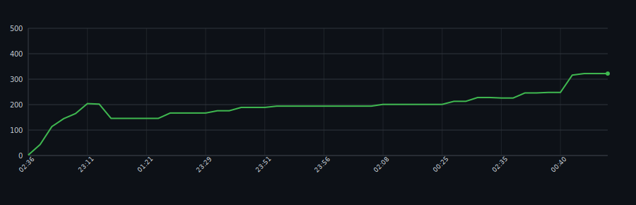

# LOC Graph Action

GitHub Action that analyzes your repository's commit history, counts lines of code (LOC) for each commit using `cloc`, and generates an SVG chart showing LOC changes over time.  
The SVG and a JSON cache are committed back to the repository automatically, so you can embed the chart directly in your README.

## Usage

In the repository where you want the LOC chart:

1. Create a workflow file `.github/workflows/loc-graph.yml`:

```yaml
name: LOC graph

on:
  push:
    branches: [ main, master ]
  workflow_dispatch:

permissions:
  contents: write

jobs:
  build-loc-graph:
    runs-on: ubuntu-latest
    steps:
      - name: Checkout full history
        uses: actions/checkout@v4
        with:
          fetch-depth: 0

      - name: Generate LOC graph
        uses: botforge-pro/loc-graph-action@main
        with:
          theme: dark  # 'dark' or 'light', default is 'light'
```

2.	Commit and push the workflow file.
3.	After the workflow runs, the generated files will appear:
   * .github/loc-history.svg — SVG chart of LOC over time
   * .github/loc_history.json — cached LOC data	
 4.	Embed the SVG in your README.md:
```

```

## Example

This repository uses its own action to track LOC over time:


