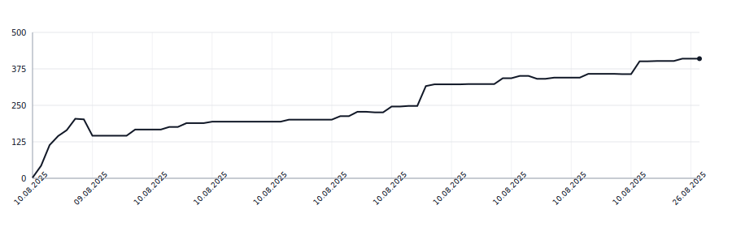

# LOC Graph Action

[](https://github.com/botforge-pro/loc-graph-action/actions/workflows/test.yml)
[](https://github.com/marketplace/actions/loc-graph-action)

GitHub Action that scans your repository's commit history, calculates lines of code (LOC) for each commit, and produces an SVG chart showing how LOC changes over time. The generated SVG and a JSON cache are automatically committed back to the repository, allowing you to embed the chart directly in your README.

## Quick Setup

Create a workflow file `.github/workflows/loc-graph.yml`:

```yaml
name: LOC graph

on:
  schedule:
    - cron: '0 0 * * *'  # Daily at midnight
  workflow_dispatch:

permissions:
  contents: write

jobs:
  build-loc-graph:
    runs-on: ubuntu-latest
    steps:
      - uses: actions/checkout@v4
        with:
          fetch-depth: 0
      - uses: botforge-pro/loc-graph-action@main
```

After the workflow has run, add the following HTML snippet to the end of your README to display the LOC graph with automatic theme switching:

```html
### Lines of Code Over Time
<picture>
  <source media="(prefers-color-scheme: dark)" srcset=".github/loc-history-dark.svg">
  <source media="(prefers-color-scheme: light)" srcset=".github/loc-history-light.svg">
  
</picture>
```

## Advanced Setup

```yaml
name: LOC graph

on:

  # Trigger on every push (mostly for testing)
  push:
    branches: [ main, master ]
  
  # Trigger daily at midnight (recommended for active projects)
  schedule:
    - cron: '0 0 * * *'

  # Allow manual triggering from the Actions tab
  workflow_dispatch:

permissions:
  contents: write

jobs:
  build-loc-graph:
    runs-on: ubuntu-latest
    steps:
      - name: Checkout full history
        uses: actions/checkout@v4
        with:
          fetch-depth: 0

      - name: Generate LOC graph
        uses: botforge-pro/loc-graph-action@main
        with:
          output_json: "docs/data/loc-cache.json"
          fallback_theme: dark  # Theme for .github/loc-history.svg
          date_format: "%Y-%m-%d"  # 2024-03-15
          time_format: "%I:%M %p"  # 03:45 PM
          exclude: ".cache,assets"  # Additional names to exclude
```

## Live example

This repository uses its own action to track LOC over time:

<picture>
  <source media="(prefers-color-scheme: dark)" srcset=".github/loc-history-dark.svg">
  <source media="(prefers-color-scheme: light)" srcset=".github/loc-history-light.svg">
  
</picture>
